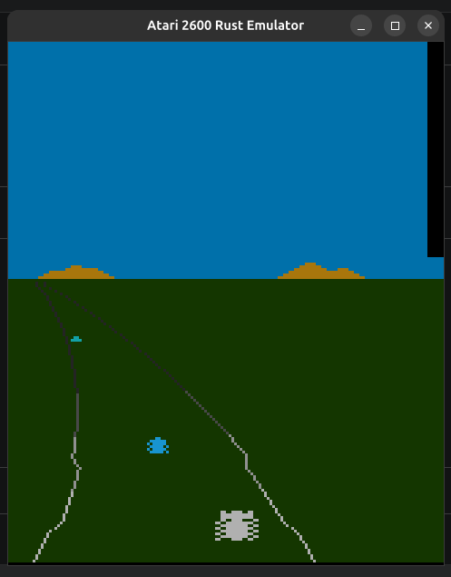
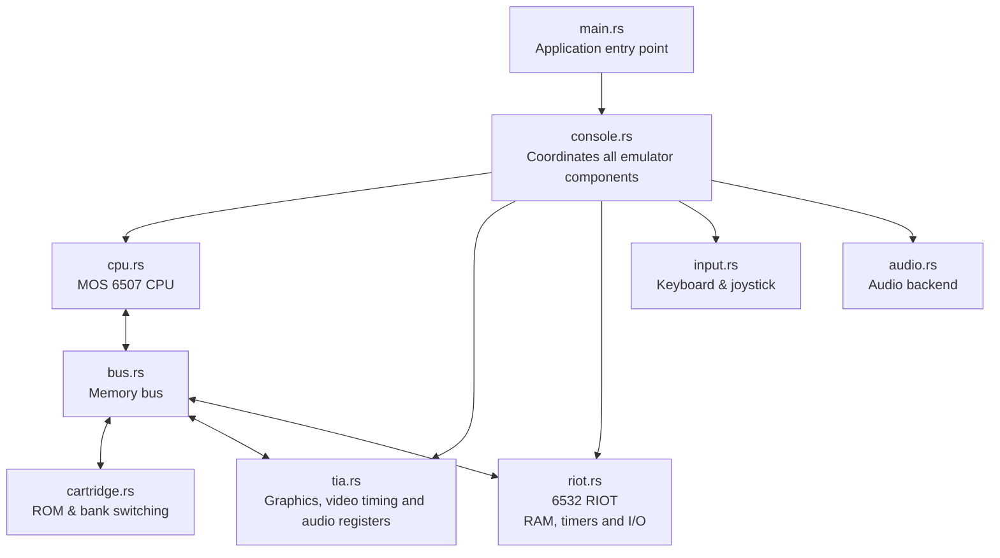

# 🕹️ Atari 2600 Emulator in Rust

A cycle-accurate (work in progress) Atari 2600 emulator written in **Rust**, focused on performance and clean architecture.

<p align="center">
  
</p>

<p align="center">
  <em>Enduro running on the emulator.</em>
</p>

---

## ✨ Features

- ✅ MOS 6507 CPU emulator
- ✅ TIA video rendering
- ✅ RIOT (6532) support
- ✅ Keyboard joystick emulation
- ✅ Adjustable screen alignment
- ✅ Configurable viewport
- ✅ Optional audio backend
- ✅ Debug & trace mode
- 🚧 Save States (planned)
- 🚧 CRT shaders (planned)

---

# Running

Clone the project:

```bash
git clone https://github.com/sl4ureano/atari2600-rust.git
cd atari2600-rust
```

Run any ROM:

```bash
cargo run -- roms/Enduro.bin
```

Example with horizontal adjustment:

```bash
cargo run -- roms/Enduro.bin --x-adjust -6
```

Without audio:

```bash
cargo run -- roms/Enduro.bin --no-audio
```

CPU/TIA trace:

```bash
RUST_LOG=trace cargo run -- roms/Enduro.bin --trace
```

---

# Controls

## Joystick (Player 1)

| Key | Action |
|------|--------|
| ← ↑ ↓ → | Move |
| Space / Z / X | Fire |

## Atari Console

| Key | Action |
|------|--------|
| Enter | Reset |
| F2 / 2 | Reset |
| F1 / 1 | Select |
| C | Color / B&W |
| A | Left Difficulty |
| S | Right Difficulty |
| R | Emulator Reset |

---

# Command Line Options

| Option | Description |
|---------|-------------|
| `--scale <N>` | Window scale |
| `--speed <N>` | Turbo mode |
| `--visible-start <N>` | First visible color clock |
| `--x-adjust <N>` | Horizontal adjustment |
| `--y-crop <N>` | Crop top scanlines |
| `--fps <N>` | Target FPS (default 60) |
| `--no-audio` | Disable audio |
| `--trace` | Enable CPU/TIA trace |

Example:

```bash
cargo run -- roms/Enduro.bin \
    --visible-start 68 \
    --x-adjust -6 \
    --fps 60
```

---

# Audio (Linux)

By default the project builds **without audio support**, avoiding `alsa-sys` issues on systems without native ALSA development headers.

Run without audio:

```bash
cargo run -- roms/Enduro.bin --no-audio
```

Enable audio:

Ubuntu / Debian

```bash
sudo apt install pkg-config libasound2-dev
cargo run --features audio -- roms/Enduro.bin
```

If you don't want to install ALSA, simply omit the `audio` feature and the emulator will still run normally.

---

# Project Structure

```text
src/
├── main.rs
├── console.rs
├── cpu.rs
├── bus.rs
├── cartridge.rs
├── tia.rs
├── riot.rs
├── input.rs
└── audio.rs
```

### Emulator Architecture



### Module Overview

| File | Purpose |
|------|---------|
| **main.rs** | Entry point. Creates the window, parses command-line arguments, loads the ROM and runs the emulation loop. |
| **console.rs** | High-level coordinator responsible for keeping all hardware components synchronized. |
| **cpu.rs** | Full implementation of the MOS 6507 CPU, including instruction decoding and cycle execution. |
| **bus.rs** | Routes every CPU memory access to the appropriate hardware component. |
| **cartridge.rs** | Loads ROM images and implements cartridge bank-switching schemes. |
| **tia.rs** | Emulates the Television Interface Adapter (TIA): video generation, sprites, playfield, collisions and audio registers. |
| **riot.rs** | Emulates the MOS 6532 RIOT chip, providing RAM, timers and I/O registers. |
| **input.rs** | Maps keyboard input to the Atari joystick and console switches. |
| **audio.rs** | Generates audio output from the TIA audio registers. |

---

# Compatibility

Current testing:

| Game | Status |
|-------|--------|
| Enduro | ✅ Playable |
| River Raid | ✅ Playable |
| Pitfall! | 🚧 |
| Space Invaders | 🚧 |

---

# Roadmap

- Accurate TIA timing
- Better collision emulation
- More cartridge mappers
- Save states
- NTSC/PAL auto detection
- CRT filters
- Gamepad support
- Debugger UI

---

# License

MIT